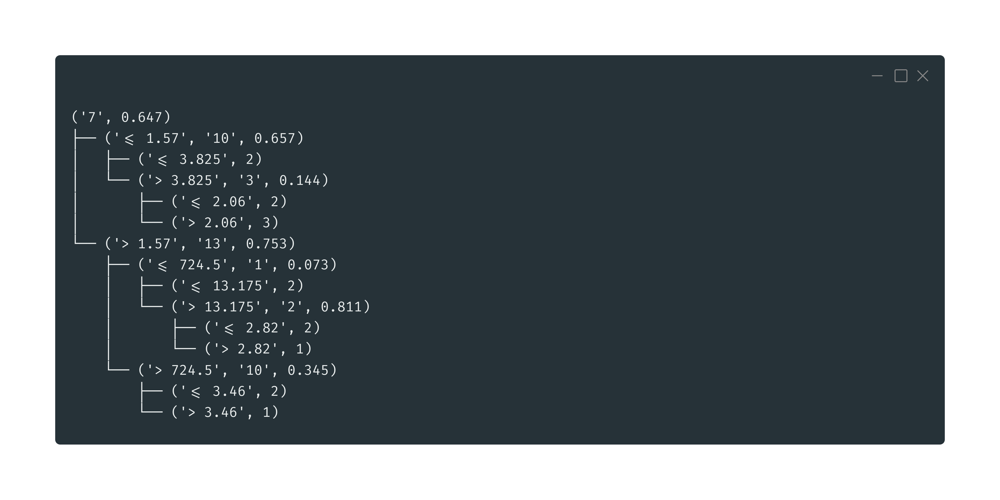

# Random Forest

Implementation of the random forest algorithm.

## Installing the requirements
```
pip3 install -r requirements.txt
```

## Decision tree

Consider the United States Congressional Voting Records dataset, in `data/house_votes_84.tsv`.


The idea is to construct a decision tree based on a training dataset. In this case, it creates a model to predict if a person is going to eat in a restaurant or not. An example of a constructed tree is given right below.

The float numbers are the information gains for each division.


And right below, there's another example of a constructed tree, using the Wine recognition dataset, in `data/wine_recognition.tsv`, that has attributes with continuous values:




### Running experiments

To view some of the resultant decision trees considering the datasets that are in the `data` folder, run the folowing command:

```
python3 main.py
```

## Random Forest

The random forest implementation used the decision tree implementation presented earlier. For the construction of each tree of the forest, we perform a random sampling with replacement of the training data. This process is know as [Bootstrapping](https://en.wikipedia.org/wiki/Bootstrapping_(statistics)).

Moreover, on each node division during the decision tree construction, a random subset of attributes are selected. The of attributes are:


Being **M** the number of features. 

The ideia is to reduce the _variance_ as the number of trees used grows. This leads to more _bias_.

## _k_-Fold Cross Validation

To validate the trained forests, we perform a cross validation. In this case, a stratified sampling is perform, one for each fold that needs to be constructed. 

In this case, when performing the validation, we iterate through each of of the folds, using the current one as the test dataset, and all the other ones, to train a forest. For each case, the accuracy of the predictions are calculated. 
