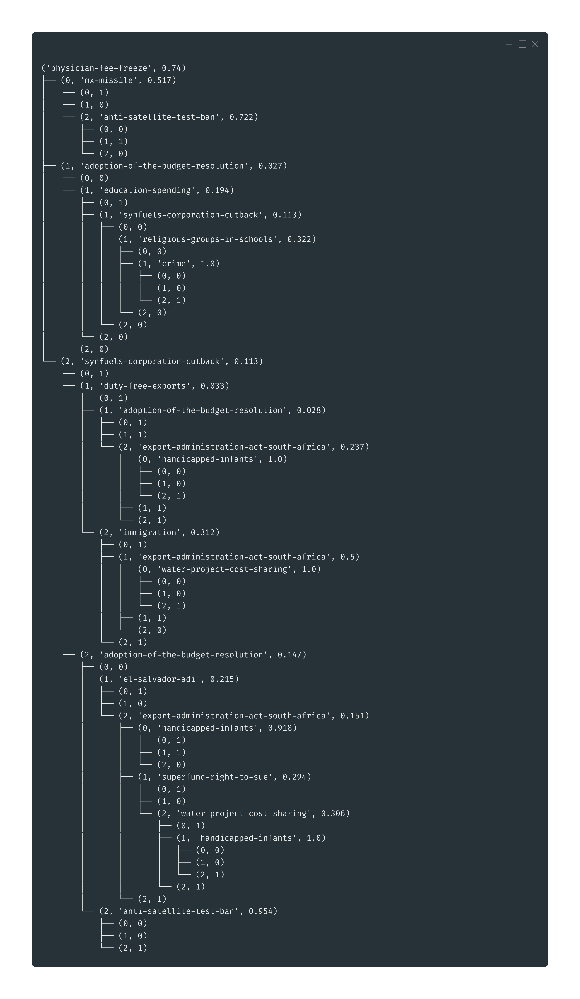

# Random Forest

Implementation of the random forest algorithm.

## Installing the requirements
```
pip3 install -r requirements.txt
```

## Decision tree

Consider the United States Congressional Voting Records dataset, in `data/house_votes_84.tsv`.


The idea is to construct a decision tree based on a training dataset. In this case, it creates a model to predict if a person is going to eat in a restaurant or not. An example of a constructed tree is given right below.

The float numbers are the information gains for each division.




## Random Forest


## Cross Validation
